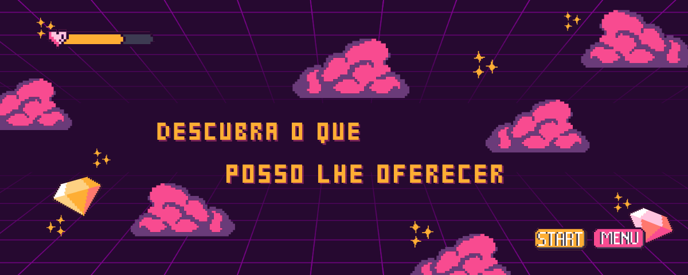

# Olá, sou a Maria! 👋

  

  

## 🚀 Sobre Mim

 

* 🧠 Atualmente focado em: Desenvolver
* 💡 Buscando colaborar em: Projetos que possua uma solução voltado a realidade
* 💬 Fale comigo sobre: TECNOLOGIA
* 📫 Como me encontrar: lopesvitoriamv@gmail.com (ou veja os links abaixo)

---

## 🔗 Onde me Encontrar

  
  
  

---

## 📊 Minhas Estatísticas (Conteúdo Dinâmico)

  
  

  

---

## 🛠️ Meu Arsenal de Tecnologias

  <strong>Front-End:</strong> 
  
  
  
  
  
    
  <strong>Back-End & Dados:</strong> 
  
  
  
  
    
  <strong>DevOps & Ferramentas:</strong> 
  
  
  

---

## 📰 Minhas Últimas Atividades

*Nenhuma atividade recente no blog. (Esta linha será substituída automaticamente)*
